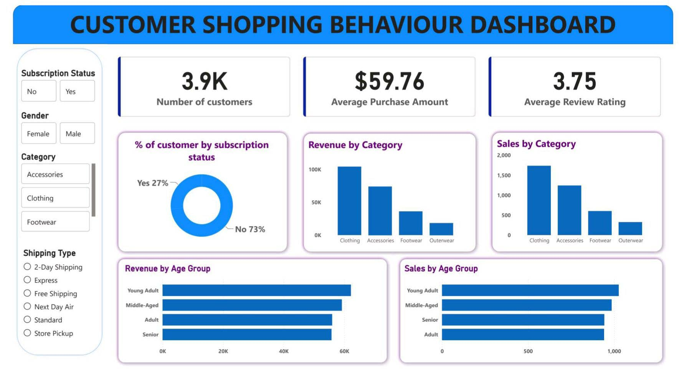

# Customer_Behaviour_Analytics_Dashboard
End-to-end Customer Behavior Analytics Dashboard using Python, SQL, and Power BI with data cleaning, feature engineering, business analysis, and interactive dashboards.

Customer Shopping Behavior Analysis Dashboard

📌 **Project Overview**

This project analyzes customer shopping behavior using transactional retail data to uncover valuable business insights. The analysis combines Python, PostgreSQL, SQL, and Power BI to build an end-to-end data analytics solution—from data cleaning to interactive business dashboards.

The objective is to help businesses understand customer purchasing patterns, product performance, customer segmentation, and revenue trends for better decision-making.

🚀 **Features**

Data Cleaning & Preprocessing using Python

Missing Value Treatment

Feature Engineering

MySQL Database Integration

SQL Business Analysis

Interactive Power BI Dashboard

Customer Segmentation

Revenue Analysis

Product Performance Analysis

Subscription & Loyalty Analysis

🛠 **Tech Stack**

Tool	- Purpose

Python -	Data Cleaning & Feature Engineering

Pandas	- Data Manipulation

NumPy	- Numerical Operations

PostgreSQL	- Database Storage

MySQL	- Business Analysis

Power BI	- Dashboard & Visualization

Git & GitHub	- Version Control

📂 **Dataset Information**

Total Records: 3,900
Total Columns: 18

Dataset includes:

Customer Demographics

Purchase Information

Product Categories

Purchase Amount

Subscription Status

Discount Details

Shipping Type

Previous Purchases

Review Ratings

Purchase Frequency

📊 **Project Workflow**

Raw Dataset

      │
      ▼
Python Data Cleaning

      │
      ▼
Feature Engineering

      │
      ▼
Load Data into PostgreSQL

      │
      ▼
SQL Business Analysis

      │
      ▼
Power BI Dashboard

      │
      ▼
Business Insights

**🐍 Python Tasks Performed**

✔ Data Loading

✔ Data Exploration

✔ Missing Value Handling

✔ Column Standardization

✔ Feature Engineering

Age Group Creation
Purchase Frequency Calculation

✔ Data Consistency Check

✔ PostgreSQL Database Connection

✔ Export Cleaned Dataset to SQL Database

🗄 **SQL Business Analysis**

The following business questions were answered using SQL:

Revenue by Gender

High Spending Customers using Discounts

Top Rated Products

Shipping Type Comparison

Subscribers vs Non-Subscribers Analysis

Discount Dependent Products

Customer Segmentation

Top Products by Category

Repeat Buyers Analysis

Revenue Contribution by Age Group

📈 **Power BI Dashboard**

The dashboard provides interactive visualizations including:

Total Revenue

Total Customers

Average Purchase Amount

Revenue by Gender

Revenue by Category

Revenue by Age Group

Subscription Status Analysis

Shipping Type Analysis

Customer Segmentation

Top Selling Products

Discount Analysis

Interactive Filters (Slicers)

💡 **Key Business Insights:**

--Subscribers contribute higher overall revenue.

--Loyal customers generate significant repeat purchases.

--Certain products heavily rely on discounts for sales.

--Express shipping customers generally spend more.

--Middle-age customer groups contribute the highest revenue.

--Product ratings strongly influence purchase behavior.

## 📊 Dashboard Preview

📁 Project Structure

Customer-Shopping-Behavior-Analysis/

│

├── Dataset/

│      shopping_trends.csv

│

├── Python/

│      Customer_Shopping_Behavior_Analysis.ipynb

│

├── SQL/

│      customer_behavior_queries.sql

│

├── PowerBI/

│      Customer_Behaviour_Dashboard.pbix

│

├── Images/

│      dashboard.png

│

├── README.md

│

└── requirements.txt

⚙ Installation

Clone Repository

git clone https://github.com/Raghavendra-Ghodse/Customer_Behaviour_Dashboard.git

Install Dependencies

pip install pandas

pip install numpy

pip install psycopg2

pip install sqlalchemy

or

pip install -r requirements.txt

PostgreSQL Setup

Install PostgreSQL

Create Database

CREATE DATABASE customer_behavior;

Update database credentials inside the Python notebook.

Run Python Notebook

jupyter notebook

Open

Customer_Shopping_Behavior_Analysis.ipynb

Execute SQL Queries

Run the SQL scripts in PostgreSQL using pgAdmin or psql.

Open Power BI Dashboard

Open

Customer_Behaviour_Dashboard.pbix

Refresh the data connection if required.

📌 Business Recommendations
Increase customer subscription benefits.

Introduce stronger loyalty reward programs.

Promote top-rated products in marketing campaigns.

Optimize discount strategies to maximize profitability.

Target high-value customer segments with personalized offers.

Improve shipping strategies based on customer preferences.

🎯 **Learning Outcomes**

Through this project, I gained practical experience in:

Data Cleaning using Python

Exploratory Data Analysis (EDA)

PostgreSQL Database Management

SQL Query Writing

Data Visualization using Power BI

Dashboard Design

Business Intelligence

Customer Analytics

End-to-End Data Analytics Workflow

👨‍💻 Author

Raghavendra Ghodse

GitHub: https://github.com/Raghavendra-Ghodse

LinkedIn: https://linkedin.com/in/raghavendra-ghodse

⭐ If you found this project useful, consider giving it a star!

